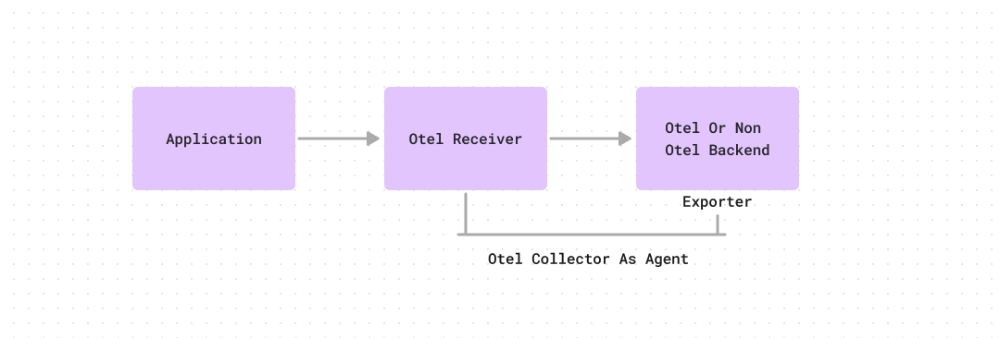
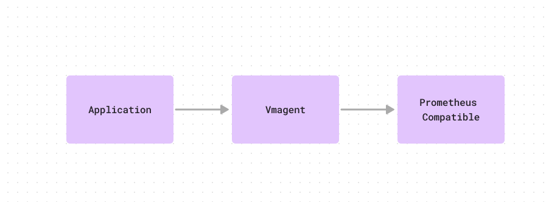
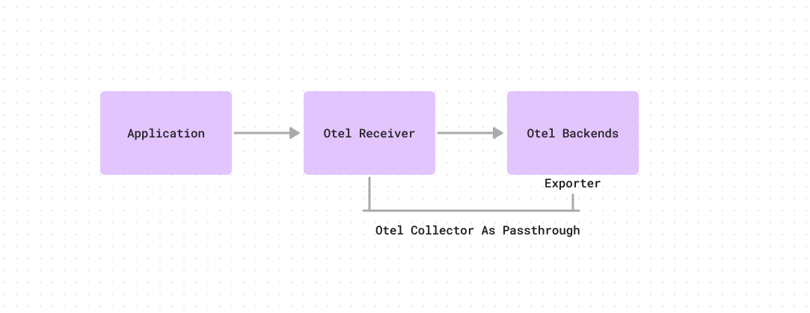
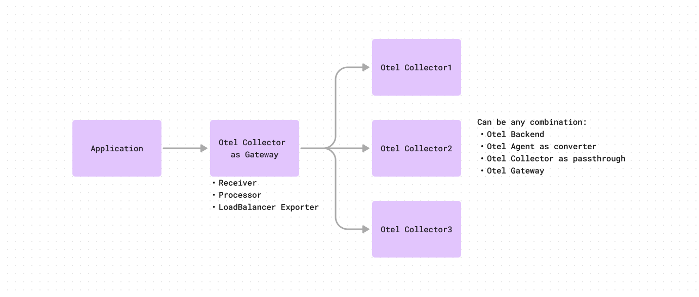

### nodejs-otel-cookbooks

This repo describes recipes for pushing instrumented code metrics via OTel to a backend.
The aim of this repo is to showcase the flexibility of OTel metric ingestion pipeline
and educate the user on various approaches so that they can take an informed decision on
which approach to follow for their specific use case.

* [Push using direct remotewrite - OTel backend](#push-using-direct-remotewrite---otel-backend)
* [Push using direct remotewrite - via collector](#push-using-direct-remotewrite---via-collector)
* [Push using agent - vmagent](#push-using-agent---vmagent)
* [Push using agent - otel agent](#push-using-agent---otel-agent)

### Push using direct remotewrite - OTel backend

- Metric ingestion flow

  


**Note: Here vmagent is used as otlp compatible backend which internally remote writing to victoriametrics, if you have an otlp backend endpoint then you can use that here at place of vmagent and victoriametrics won't be required.**

- Pros:

  - This setup can push directly to an OTel supported backend. Here backend means the storage system that you are going to query e.g. Prometheus.
  - Simple setup - no intermediate agents e.g. vmagent, prometheus-agent are required.

- Cons:

  - Lack of intermediate agent implies that the application has to fulfill the role of ensuring - retrying
    if backend not available, buffering data up to a certain point, etc.

  - The application upfront declares that it is tightly coupled with OTel based ingestion mechanisms. If we need
    to move this away from pure OTel based setup to an intermediate agent based flow e.g. vmagent, it will need
    code refactoring.

- Try it out

  ```
  cd push-using-direct-remotewrite/direct-backend

  source env.sh

  # Read main.go for understanding the instrumentation done

  docker-compose up

  # Make a few calls to push metrics
  for i in $(seq 1 10); do curl "http://localhost:8081/api/fast"; echo; sleep 1; done

  # Check the pushed metric http_requests_total
  http://localhost:8439/vmui/
  ```

  This setup currently pushes to a vmagent based backend, because the test setup doesn't have an OTel backend to write to.

### Push using direct remotewrite - via collector

- Metric ingestion flow

  

**Note: Here vmagent is used as metrics_expoint in otlphttp, it can be any otel backend url also, in such scenarios you don't need vmagent and victoriametrics, you can use otlp backend url in exporter.**

- Pros:
  - Has an advantage over the previous flow - the application can delegate parts of the resiliency logic to the
    collector.
  - User can do intermediate processing via the `processor` section.
  - When moving away from an existing agent based setup to a pure OTel setup, this flow can leverage your existing agent setup
    to remove the scrape functionality but still keep the remote write functionality.

- Cons:
  - Requires maintaining both OTel and vmagent setups.
  - Can only support single endpoint for ingestion => scenarios like agent clustering cannot be leveraged.

- Try it out

  ```
  cd push-using-direct-remotewrite/via-collector

  source env.sh

  docker-compose up

  # Make a few calls to push metrics
  for i in $(seq 1 10); do curl "http://localhost:8081/api/fast"; echo; sleep 1; done

  # Check the pushed metric http_requests_total
  http://localhost:8439/vmui/
  ```

### Push using agent - vmagent

- Metric ingestion flow

  

- This sample setup shows integrating one of the popular metric ingestion agents e.g. vmagent which supports OTel based ingestion.

- How is this different from pushing via direct remote write collector scenario described above?
  - In the collector based approach the flow was - application -> otel receiver -> otel backend (vmagent) -> storage (Levitate, Prometheus, etc.)
  - In this approach, there is no OTel config required as per the metric ingestion flow described above.

- Pros:
  - Systems already using vmagent but wants to move to otel bases instrument can take this as a starting step.
  - As long as the agent supports OTel based ingestion, the application can write to it with instrumented OTel code.

- Cons:
  - Dependency on an agent outside of the OTel ecosystem.
  - Advantages of processor in Otel collector won't be avaialble here
  - Can be used only for sending metric based telemetry , no other types like logs and spans.

- Try it out

  ```
  cd push-using-agent/vmagent

  source env.sh

  docker-compose up

  # Make a few calls to push metrics
  for i in $(seq 1 10); do curl "http://localhost:8081/api/fast"; echo; sleep 1; done

  # Check the pushed metric http_requests_total
  http://localhost:8439/vmui/
  ```

### Push using agent - otel agent

- Metric ingestion flow

  

- Pros:
  - No need to maintain another agent - directly use the OTel agent based flow by leveraging the `exporter` section.

- Cons:
  - Similar to the earlier approaches, where if you move away from an existing known agent e.g. vmagent, you have to relearn the failure modes
    of the new agent and account for that knowledge during debugging scenarios via metrics and logs.
  - Scalibility has to maintained as per load via manual actions.

- Try it out

  ```
  cd push-using-agent/otel-agent

  source env.sh

  docker-compose up

  # Make a few calls to push metrics
  for i in $(seq 1 10); do curl "http://localhost:8081/api/fast"; echo; sleep 1; done

  # Check the pushed metric http_requests_total
  http://localhost:8439/vmui/
  ```

### Push using agent - gateway

- Metric ingestion flow

  

- Pros:
  - This setup lays the foundation for future scalability by providing the ability to horizontally scale collectors.
  - Separation of concerns such as centrally managed credentials.
  - Can act as a central metric ingestion setup across an org / business unit because of its ability to horizontally scale.

- Cons:
  - Requires understanding OTel config for load balancing well enough to achieve the right behaviour.
  - It’s one more thing to maintain and that can fail (complexity)
  - Added latency in case of cascaded collectors
  - Higher overall resource usage (costs)

- Try it out

  ```
  cd push-using-agent/otel-gateway

  source env.sh

  docker-compose up

  # Make a few calls to push metrics
  for i in $(seq 1 10); do curl "http://localhost:8081/api/fast"; echo; sleep 1; done

  # Check the pushed metric http_requests_total
  http://localhost:8439/vmui/

  ```
